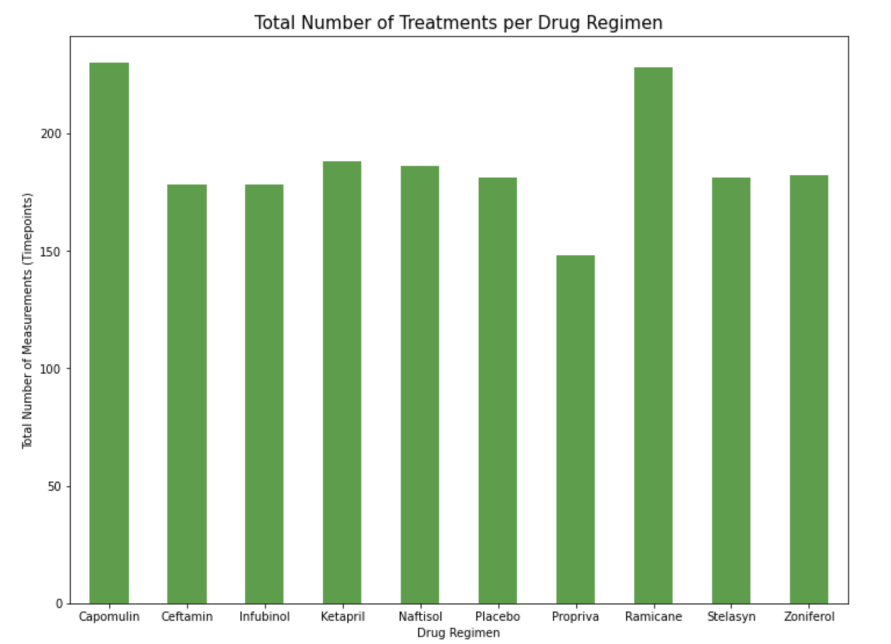
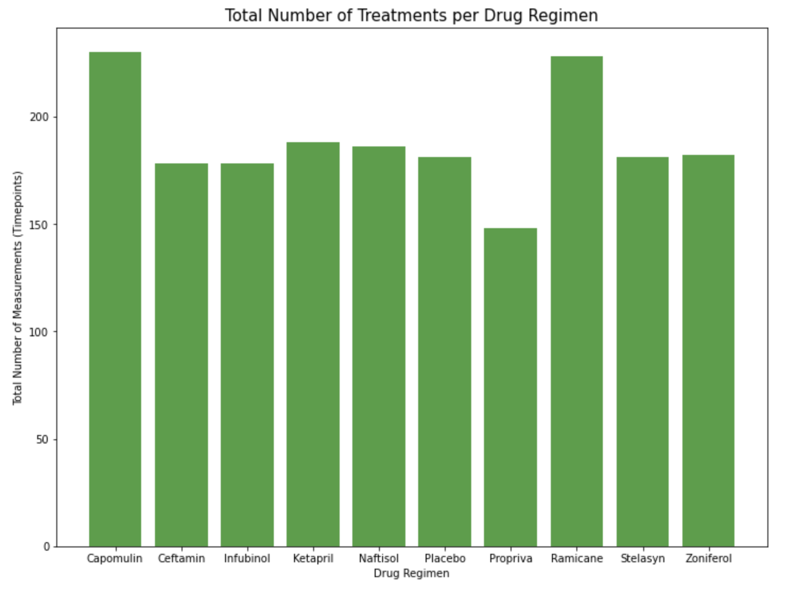
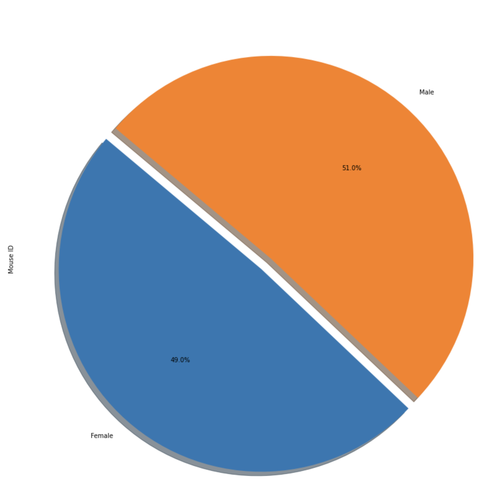
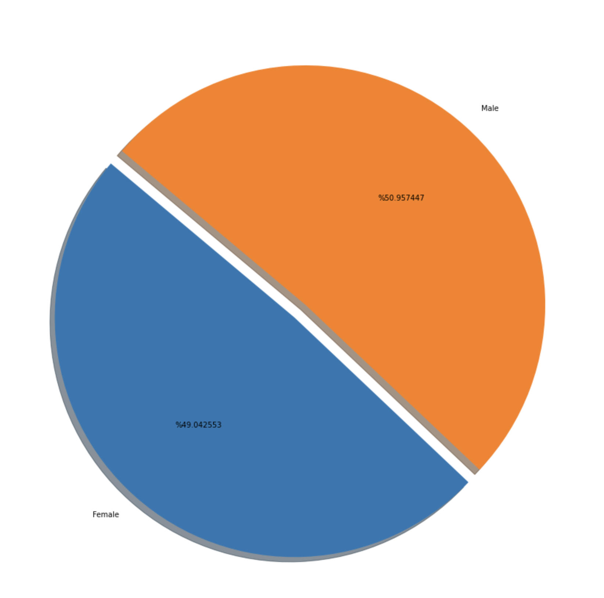
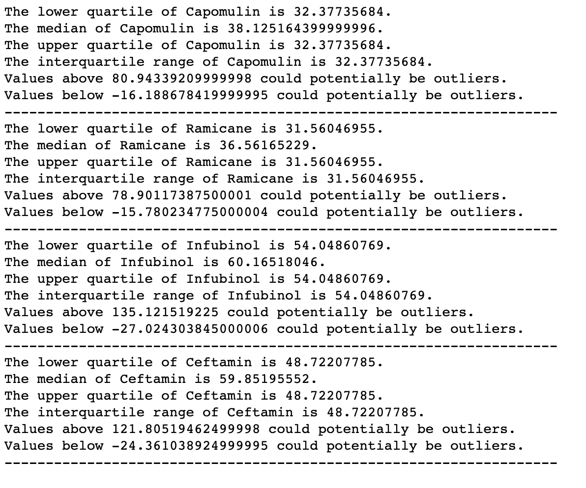
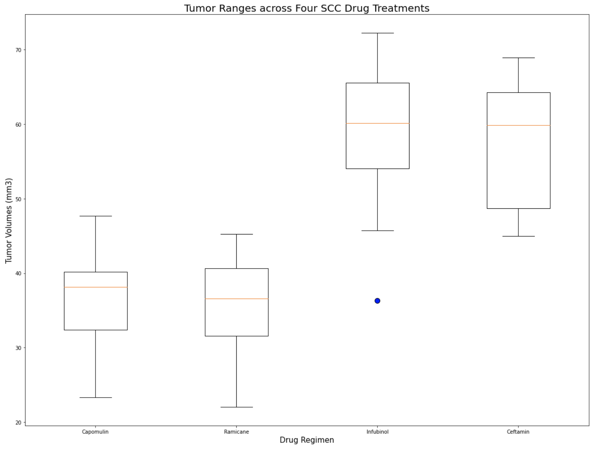

# Drug Therapy Animal Study

## Background Information

In this theoretical project application, I assumed the role as a data analyst for Pymaceuticals Inc., a burgeoning pharmaceutical company based out of San Diego. Pymaceuticals specializes in anti-cancer pharmaceuticals. In its most recent efforts, it began screening for potential treatments for squamous cell carcinoma (SCC), a commonly occurring form of skin cancer.

In Pymaceuticals Inc. most recent animal study, 249 mice identified with SCC tumor growth were treated through a variety of drug regimens. Over the course of 45 days, tumor development was observed and measured. The purpose of this study was to compare the performance of Pymaceuticals' drug of interest, Capomulin, versus the other treatment regimens. For this assessment, I generated all of the tables and figures needed for the technical report of the study, along with an overview summary of the study results at the beginning of the Jupyter Notebook.

Programming dependencies and languages used within this repository: Pandas, Matplotlib, and Jupyter Notebook.

## Data Visualization Procedure

* It is important to understand factors within a research study that may skew the results or interpretation of the data, such as duplicates within the dataset. Prior to creating any of the tables or figures for the technical report of the study, I checked the data for any mouse ID with duplicate time points and remove any data associated with that mouse ID. There was only one ID that was duplicated within the dataset (`Mouse ID g989`), and once removed the dataset was reduced by 13 entries.

* Original Dataframe:

* Reduced Dataframe:

### Summary Statistics Tables

* For an initial statstical overview, I generated a summary statistics table consisting of the mean, median, variance, standard deviation, and SEM of the tumor volume for each drug regimen.

  * I generated a summary statistics table using Pandas' `.groupby()` method:

  

  * And recreated the same summary statistics table using Matplotlib's `.aggregate()` method:

  

### Total Number of Measurements Bar Charts

* I determined that a bar chart would best represent the total number of measurements taken for each treatment regimen throughout the course of the study.

  * I accomplished this using both Pandas's `DataFrame.plot()` method:
  
  

  * As well as Matplotlib's `pyplot` method: 

  

### Sex Distribution Pie Charts

* In order to observe the distribution of female or male mice in the study, I generated pie plots that displayed the percentage of each sex out of the total 249 mice within the study.

  * This was accomplished using both Pandas's `DataFrame.plot()` method:

  

  * And subsequently repeated using Matplotlib's `pyplot` method: 

  

### Final Tumor Volume Quartiles. IQR, and Potential Outliers

* One key analysis within this technical report was to visualize the final tumor volume of each mouse across four of the most promising treatment regimens: Capomulin, Ramicane, Infubinol, and Ceftamin. I successfully calculated the quartiles and IQR, and then quantitatively determined any potential outliers across all four treatment regimens that may skew the interpretation of our results.

### Final Tumor Volume Box Plots

* I visualized this assessment further by generating box and whisker plots of the final tumor volume for all four treatment regimens and highlighted any potential outliers in the plot by changing their color and style. All four box and whisker plots were charted on a singular graph. 

* Select a mouse that was treated with Capomulin and generate a line plot of tumor volume vs. time point for that mouse.

* Generate a scatter plot of tumor volume versus mouse weight for the Capomulin treatment regimen.

* Calculate the correlation coefficient and linear regression model between mouse weight and average tumor volume for the Capomulin treatment. Plot the linear regression model on top of the previous scatter plot.

* Look across all previously generated figures and tables and write at least three observations or inferences that can be made from the data. Include these observations at the top of notebook.

### Copyright

Trilogy Education Services © 2020. All Rights Reserved.
